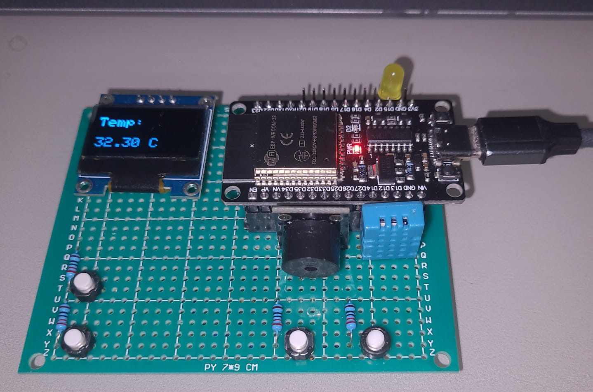

# Project Description

Code made to test FreeRTOS in development board (JP ESP32 Basic). 
The application read temperature and humidity and displays in the OLED display, 
and if the user press the button he can change from one to another.

# Photo of the development board

